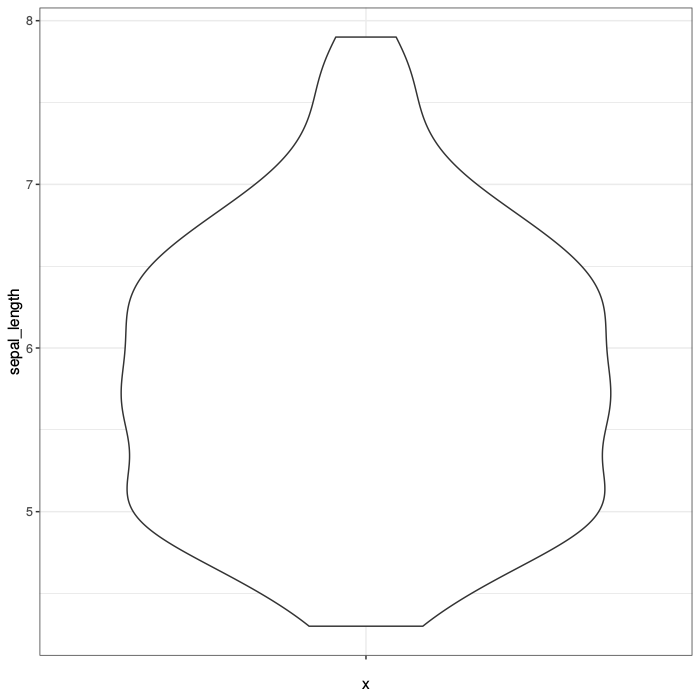
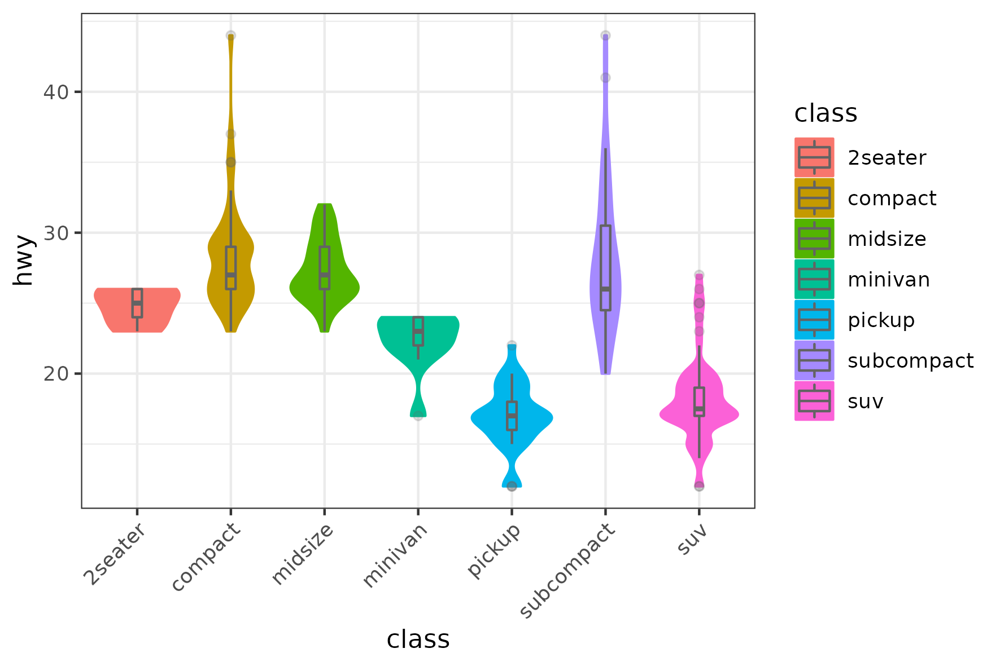

# rvispack

<!-- badges: start -->
<!-- badges: end -->

This [ggplot](https://ggplot2.tidyverse.org/) powered package is still
in development and includes several data visualization
techniques. Currently, the most complete function is to create
`violin` plots. However, other techniques are being implemented such
as `histograms` and `projections`. The later technique is generated as
a result of applying Principal Component Analysis.

## Containers

The easiest way to run the implemented data visualization techniques
is by installing [Docker](https://docs.docker.com/engine/install/)

### Testing the container

```shell
docker run --rm venustiano/cds:rvispack-0.1.0
```

### Parameters

The functions implemented in the `rvispack` container receive two
parameters. First, the data visualization function to be executed,
namely, `histogram`, `pca` and `violin`. Second, a json file structure
including the required information to create the visualization. For
example, assuming that the files `violin_parameters_iris.json`

```json
{
	"filename": "iris.csv",
	"y_variable": "sepal.length"
}
```

and `iris.csv` are in the current working directory. Make sure that
the value of `y_variable` is a column name in `iris.csv`. Running the
command


#### Linux and MacOS

```sh
docker run --rm -v "$PWD":/app/data venustiano/cds:rvispack-0.1.0 violin violin_parameters_iris.json
```

#### Windows powershell

```
docker run --rm -v ${PWD}:/app/data venustiano/cds:rvispack-0.1.0 violin violin_parameters_iris.json
```


will produce a violin plot in the `Rplots.pdf` file. 



To get a list of all possible `key-value` pairs, use the name of the
function and `help` as follows:


```bash
docker run --rm venustiano/cds:rvispack-0.1.0 <function_name> help
```

Replace the text between the angle brackets by `histogram`, `pca` or `violin`.

### Results

The results of running the visualization functions can be specified as
`key-value` pairs in the json file as a static file or as an
interactive html visualization. If not `key-value` pair is specified,
an `Rplot.pdf` will be saved in the current working directory.

The `key-value` pair in the json structure can be specified as follows:

```json
{ 
	"save": {
		"save": true,
		"width": 15,
		"height": 10,
		"device": "pdf"
	},
	"interactive": false
}
```
The static and interactive results will be stored in the `filename` path with automatically generated names.


## Installation in R

You can install the development version of pcaprojection from
[GitHub](https://github.com/) with:

``` r
# install.packages("devtools")
devtools::install_github("Venustiano/testpackage")
```

## Example

This is a basic example which shows you how to create projection:

``` r
library(pcaprojection)
## basic example code
## The function in the R package receive only the json parameter file

p <- cm_ggviolin("violin_parameters_iris.json")
```

## A containerized example

Given the following `mpg_params.json` and `ggplotmpg.csv` files exist
in the same folder. The latter file can be found in
`tests/testhat/data`.

```json
{
    "filename": "ggplotmpg.csv",
    "y_variable": "hwy",
    "x_variable": "class",
    "colour": "class",
    "fill": "class",
    "rotxlabs": 45,
    "boxplot": {
    	"addboxplot": true,
	    "width": 0.1
    },
	  "save":{
		  "save": true,
		  "width": 15,
		  "height": 10,
		  "device": "png"
	  }
}
```

We can run

```bash
docker run --rm -v "$PWD":/app/data venustiano/cds:rvispack-0.1.0 violin mpg_params.json
```


